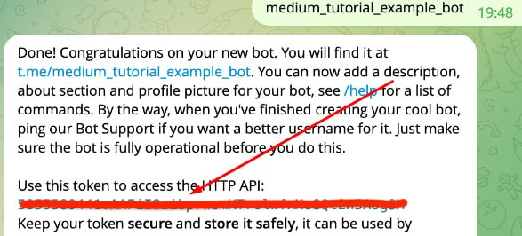
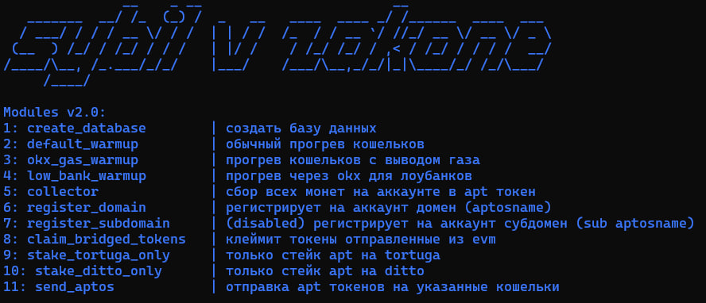

# Aptos aio

#### *Описание:*

Скрипт имеет 11 модулей:

1. `create_database` создание базы данных, которая хранит в себе данные о каждом кошельке в прогоне.
2. `default_warmup` прогон кошельков без возможности автоматического вывода газа с биржи *(включает в себя свапы на различных dex и стейк на tortuga и ditto)*.
3. `warmup_with_gas` прогон кошельков с возможностью автоматического вывода газа с биржи okx *(включает в себя свапы на различных dex и стейк на tortuga и ditto).*
4. `low_bank_warmup` прогон кошельков на объем с возможностью автоматического депозита на биржу, когда объем набран *(например, ваш общий деп 100 USDT, вы хотите прогнать объем на 1000 USDT на каждом кошельке. Скрипт наберет нужный объем и переведет ваш депозит обратно на биржу, с биржи на следующий кошелек и так по кругу).*
5. `collector` сбор всех монет на аккаунте в нативный токен *APT.*
6. `register_domain` регистрирует на аккаунт домен (aptosname) с рандомным именем больше 6 символов
7. `register_subdomain` (disabled, на данный момент отключено) регистрирует на аккаунт субдомен (aptosname) с рандомным именем больше 6 символов
8. `claim_bridged_tokens` клеймит токены отправленные из evm через мост (юзать только там, где они действительно есть, иначе будут ошибки)
9. `stake_tortuga_only` **только** стейк в *tortuga,* без свапов.
10. `stake_ditto_only` **только** стейк в *ditto,* без свапов.
11. `send_aptos` отправка APT токенов на указанные кошельки в `data/addresses.txt`

#### *Установка:*

1. `cd путь/к/проекту`
2. `pip install -r requirements.txt`

#### *Настройка:*

Все настройки находятся в файле `config.py`

* `wallets_txt_path` отвечает за путь к файлу с приватными ключами *(по умлочанию находится в `data/wallets.txt`).*
* `proxys_txt_path` отвечает за путь к файлу с прокси *(по умлочанию находится в `data/proxys.txt`).*
* `database_path` отвечает за путь к файлу с базой данных *(по умлочанию находится в `data/database.json`).*
* `node_url` отвечает за *RPC* *(по умолчанию `https://fullnode.mainnet.aptoslabs.com/v1`).*
* `tokens_mapping` название и соответствующий адрес контракта для монет, которые будут использоваться для свапа, чтобы добавить нужную монету нужно сделать запись в следующем формате: `"название монеты": "адрес контракта"`.
* `sleep_time` диапазон времени ожидания между свапами.
* `cex_sleep_time` диапазон `[от, до]` времени ожидания между выводами с биржи.
* `total_tries` количество попыток для свапа, если во время свапа была ошибка.
* `min_gas_balance` минимальный баланс в *APT* на кошельке *(в случае, если баланс меньше указанного значения, то будет вызван модуль, который пополнит кошелек с биржи).*
* `gas_withdraw_deviation` диапазон `[от, до]` количества *APT* которое будет выведено с биржи, если `min_gas_balance` меньше указанного значения *(учитывайте, что `min_gas_balance` должен быть меньше, чем минимальное значение диапазона).*
* `swap_deviation` диапазон `[от, до]` в % сколько токенов свапать от монеты с наибольшим балансом (значения от 0 до 1, где 1 = 100%, например 0.8 = 80% и тп).
* `use_proxy` принимает значения:
  * `True` если прокси используются *(вне зависимости какой, даже если мобильный)*.
  * `False` если прокси не используются.
* `use_mobile_proxy` принимает значения:
  * `True` если вы используете мобильный прокси.
  * `False` если используются не мобильные прокси, либо их нет.
* `pancakeswap_swap_count` диапазон `[от, до]` количества свапов, которые будут сделаны на *pancakeswap*.
* `liquidswap_swap_count` диапазон `[от, до]` количества свапов, которые будут сделаны на *liquidswap.*
* `tortuga_stake_count` диапазон `[от, до]` количества раз стейка на *tortuga.*
* `tortuga_stake_deviation` диапазон `[от, до]` количества токенов *APT*, которые будут застейканы на *tortuga* *(минимальное количество должно быть не меньше **0.01**).*
* `ditto_stake_count` диапазон `[от, до]` количества раз стейка на *ditto.*
* `ditto_stake_deviation` диапазон `[от, до]` количества токенов *APT*, которые будут застейканы на *ditto *(минимального значения нет, но лучше не ставить меньше **0.0001**)*.*
* `loss_ratio` **(С ЭТИМ ОЧЕНЬ АККУРАТНО)** коэффициент потери при свапе *(например, при свапе 1 USDT с  `loss_ratio` равным 0.99 в USDC полу*чим: `1 * 0.99 = 0.99` *USDC*. **С `loss_ratio` равным 0, вы будете терять 100% от суммы свапа!** *Поэтому советуем оставить это значение равным **0.99**).*
* `loss_ratio_changer` уменьшитель коэффициента `loss_ratio` *(если свап не прошел, то следующая попытка уменьшит `loss_ratio` на `loss_ratio_changer`, количество таких попыток указано в `total_tries` в конфиге выше).*
* `tg_token` токен *Telegram* бота для отправки уведомлений о работе скрипта *(токен можно получить у Telegram бота [@BotFather](https://t.me/BotFather), нажмите кнопку start, в появившемся списке нужно выбрать команду `/newbot`, введите название — это имя, которое будет отображаться сверху, укажите юзернейм, который будет у вашего бота. Вам нужно будет скопировать полученный токен и вставить в данный параметр).*

* `claimable_token` содержит в себе название токена из `tokens_mapping`, скрипт будет клеймить данный токен в `claim_bridged_tokens` модуле
* `okx_sub_creds` содержит креды от суб акков OKX, формат как и от main аккаунта, но закидывается в формате, который как пример указан в конфиге
* `low_bank_total_tries` количество попыток, которые скрипт будет запускать ожидание ввода средств на OKX в low bank warmup режиме, в случае если все попытки закончатся и деньги так и не дойдут, то скрипт остановит работу
* `withdraw_for_names` количество от и до токенов APT для вывода с биржи OKX для клейма aptosname
* `withdraw_for_low_bank` количество от и до токенов APT для вывода с биржи OKX для прогрева кошельков (вывод на акк -> активности -> вывод на биржу -> вывод на акк2 -> и тд.)
* `captcha_key` API ключ от сервиса `https://rucaptcha.com/`, который позволяет решать капчи для aptosname (решение 1 капчи стоит очень мало: <0.01$)
* `change_ip_url` При использовании мобильных прокси есть ссылка для смены ip, если вы используете мобильные прокси, то впишите данную ссылку полностью ниже
* `circle_swaps_count` Количество свапов подряд на одном аккаунте, учитывайте, что в low bank warmup есть встроенный коллектор, его свапы сюда не входят
* `aptos_names_count` Количество раз от и до сколько клеймить aptosname на один аккаунт
* `sub_aptos_names_count` Количество раз от и до сколько клеймить sub aptosname на один аккаунт
* `send_ratio` Коэффициент токен для отправки APT на адрес (к примеру биржи OKX), также используется для low_bank_warmup (пример: 1 APT = 1 * send_ratio APT будет отправлено, следовательно при send_ratio = 0.9 будет отправлено 0.9 APT)
* `tg_ids` *id* пользователей, кому будут отправлятся уведомления *([https://t.me/getmyid_bot](https://t.me/getmyid_bot) id можно получить в этом боте, нажав кнопку start, оттуда скопируйте ваш **user ID.** Формат записи следующий: `tg_ids = [121232313, 123213123, 123341233]`)*.
* `change_ip_url` используется для указания ссылки, которая меняет IP адрес для мобильных прокси.
* `use_proxy_okx` ставить True, если нужно использовать прокси для вывода с биржи OKX.

#### *Запуск:*

Добавьте ваши приватные ключи в `data/wallets.txt`, прокси *(если они есть)* в `data/proxys.txt`, адреса биржи *(если они есть)* в `data/addresses.txt`.

Для запуска скрипта в консоль нужно написать: `python main.py`, после чего перед вами появится выбор модулей:

Если вы запускаете скрипт впервые, то в первую очередь нужно выбрать *1* модуль для создания базы данных, для ваших кошельков, после отработки *1* модуля вы можете выбрать любой нужный вам модуль.

##### *Важно!*

При сбоях в работе скрипта, либо ручной отмене его работы, скрипт запоминает состояние кошельков на момент остановки в файле `data/database.json`, за который как раз отвечает *1* модуль (`create_database`). Если вы добавили новый приватный ключ в `data/wallets.txt` либо хотите стереть прошлое состояние, то вам нужно запустить *1* модуль снова. Если же вам нужно продолжить работу из прошлого состояния, то запускать модуль *1* не нужно.

Также в случае, если вы после запуска 1 модуля запускали еще какой-либо модуль, то данные в базе данных изменились и если после прогона 2 модуля вы решили запустить 7 модуль, то вам нужно будет сразу запусть 1 модуль для создания базы данных заново, а после уже запускать 7 модуль.

Рекомендуем использовать для прогрева `low_bank_warmup` модуль. Ставить `withdraw_for_low_bank = [0.15, 0.20]` и `send_ratio = 0.9`, при этом на балансе OKX купить всего около 2-3 APT для 120 аккаунтов. Все акки прокрутятся и будут иметь 50+ транзакций с минимальными затратами на газ и начальными вложениями.
